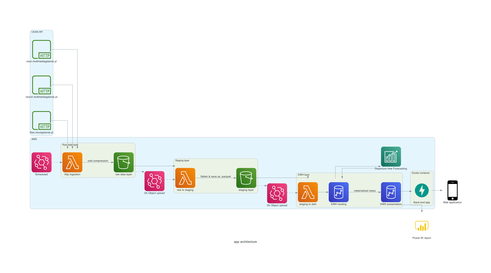

# Praca magisterska
Repozytorium przygotowane na potrzeby pracy magisterskiej

## Cel pracy
Przygotowanie sytemu przetwarzania danych udostępnianych przez ZTM w Gdańsku na platformie CKAN w środowisku chmurowym AWS z raportem PowerBi jako produktem końcowym.

## Proponowane tematy pracy
1. Zastosowanie podejścia Infrastructure as a Code w projektach przetwarzania danych na przykładzie wykorzystania narzędzia Terraform do przetwarzania danych ZTM w Gdańsku
2. Budowa systemu przetwarzania danych z wykorzystaniem komponentów chmurowych AWS na zbiorze danych „Otwarte dane ZTM w Gdańsku”

Przykładowa architektura rozwiązania (w zalezności od tematu zbudowana manualnie i w pracy nacisk połozony na opis komponetów AWS lub architektura zbudowana za pomocą Terraform oraz praca skupiona na opisie wykorzystania tego podejścia wraz z oceną zalet i wad)
